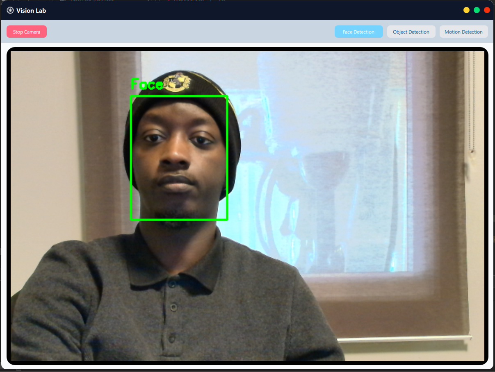
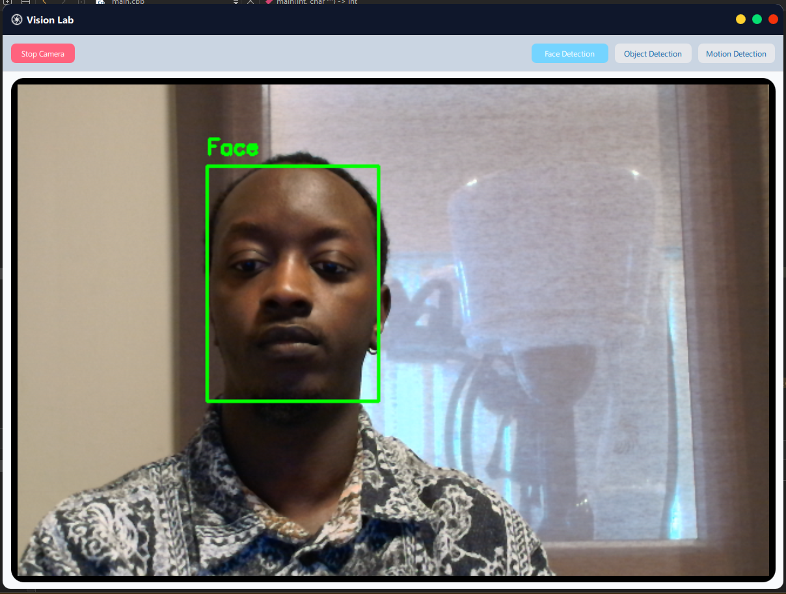
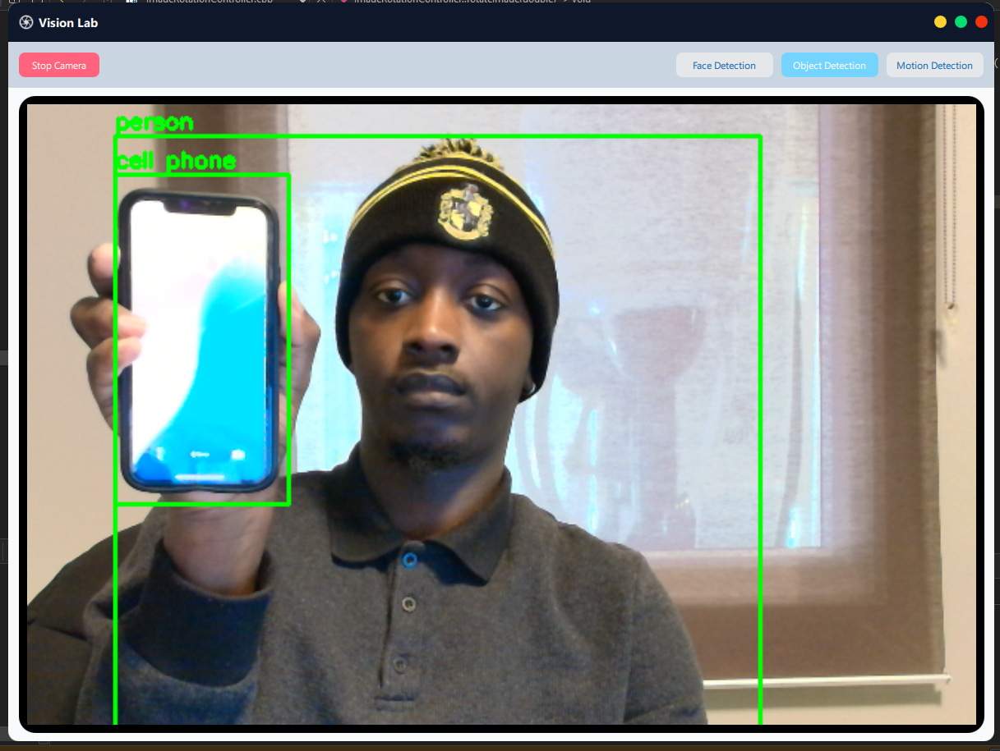
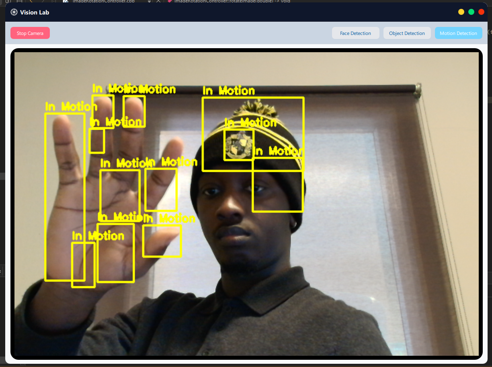

# Vision Lab - Computer Vision Application



VisionLab is a real-time computer vision application built with Qt (QML + C++) and OpenCV.
The project focuses on a robust camera pipeline, live image rendering, and an extensible architecture for adding vision modules (such as motion detection, object detection, face detection) in a clean and modular way.

The current implementation prioritizes performance, stability, and clean architecture, with detectors designed to be developed and integrated as separate modules or projects.

## • Features

- Live camera capture using OpenCV

- Real-time frame rendering in QML via a custom QQuickImageProvider

- Clean separation between UI, camera management, and vision logic

- Motion detection module (lightweight and CPU-friendly)

- Dark/idle frame handling when no camera stream is available

- Extensible design for adding future detectors (object, text, etc.)

## • Technologies Used

- C++ (C++17)
- Qt 6
- Qt Quick (QML)
- Qt Core / GUI
- OpenCV
- CMake
- QML Image Provider
- Multithreading (std::thread)

## • Models Used in This Project
- Face Detection

Model:ResNet SSD Face Detector (Caffe)
Files: deploy.prototxt, res10_300x300_ssd_iter_140000.caffemodel
Framework: OpenCV DNN
Purpose: Detect human faces in the live camera stream.



- Object Detection

Model: YOLOv4-Tiny
Files: yolov4-tiny.cfg, yolov4-tiny.weights, coco.names
Framework: OpenCV DNN (Darknet backend)



- Motion Detection

Model: Background Subtraction (No ML model)
Algorithm: OpenCV Background Subtractor (e.g. MOG2)
Framework: OpenCV
Purpose: Detect motion regions in the camera feed.


## • Setup & Development
## • Prerequisites

Make sure you have the following installed:

Qt 6.x
Qt Quick
Qt Widgets

OpenCV (built with DNN disabled is fine for this project)

CMake ≥ 3.16
C++17 compatible compiler
MSVC / GCC / Clang

## • OpenCV Setup

Ensure OpenCV is correctly installed and accessible.

Example (Windows):

```bash
# Clone the repository
git clone https://github.com/Muhammedsuwaneh/vision-lab.git

# Navigate to the project folder
cd vision-lab
```

```bash
set(OpenCV_DIR "C:/opencv/build")
find_package(OpenCV REQUIRED)
````

Verify:

opencv_world or core modules are found

Camera access works (cv::VideoCapture)

```bash

mkdir build
cd build
cmake ..
cmake --build .
```
Or open directly in Qt Creator and configure with CMake

## • Run the Application

After building:

Run from Qt Creator or
Execute the generated binary from the build folder
Make sure:

A webcam is connected
Camera permissions are granted (Linux/macOS)

## • Version 
1.0.0

## • Licensed
Under [`MIT`](LICENSE) - Copyright 2025/2026 
